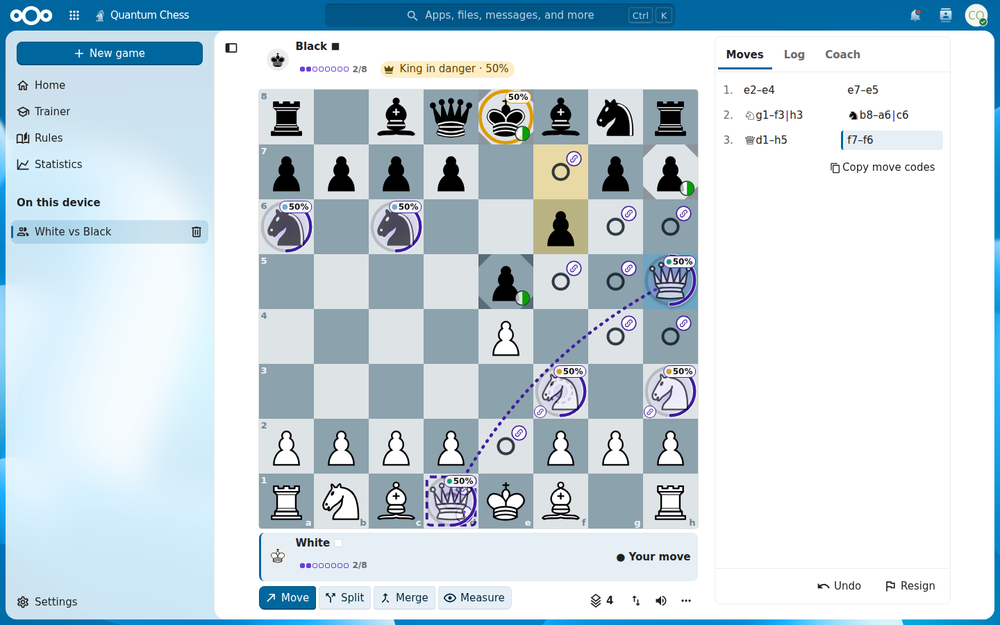
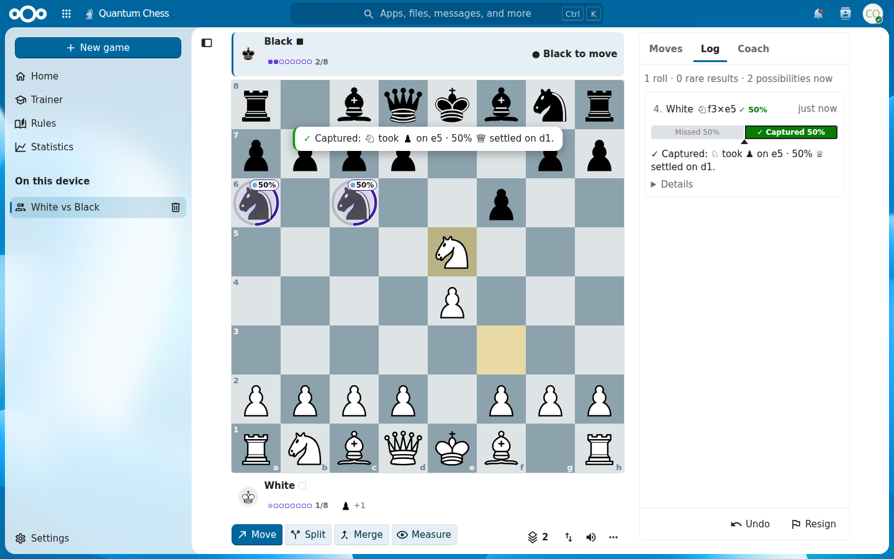
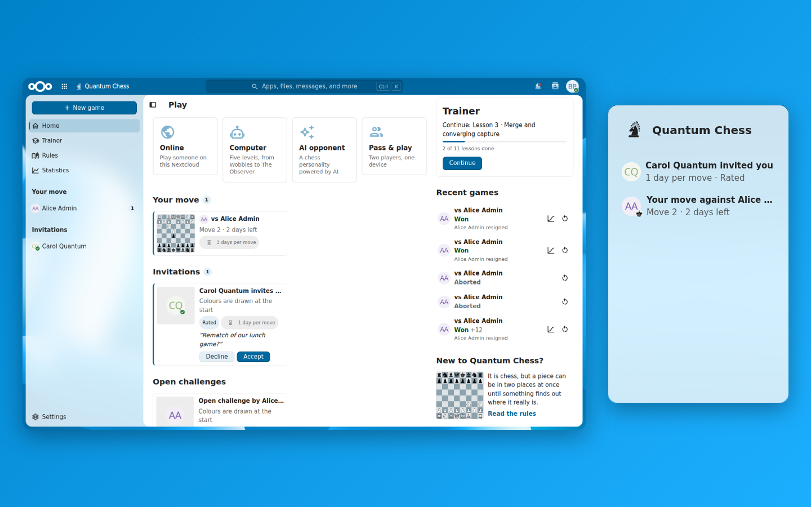
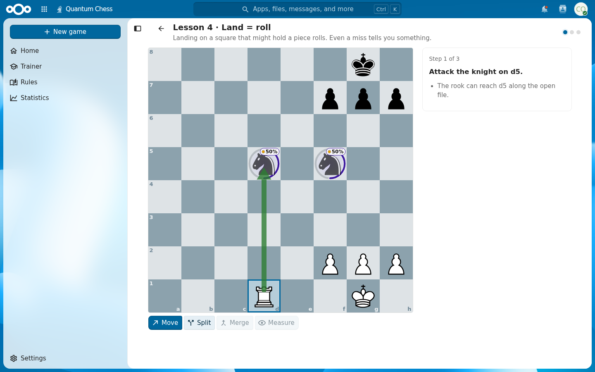
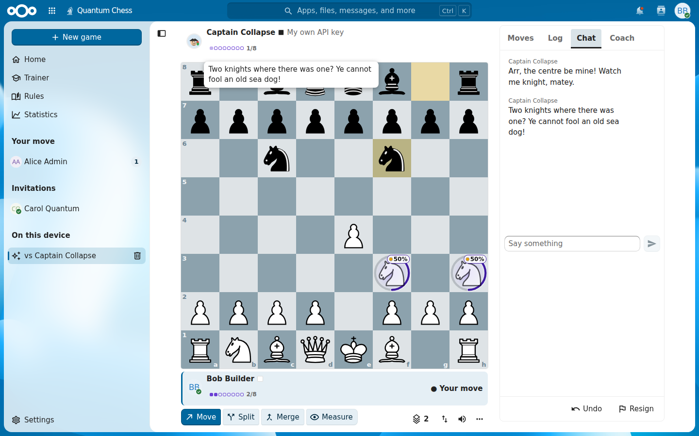
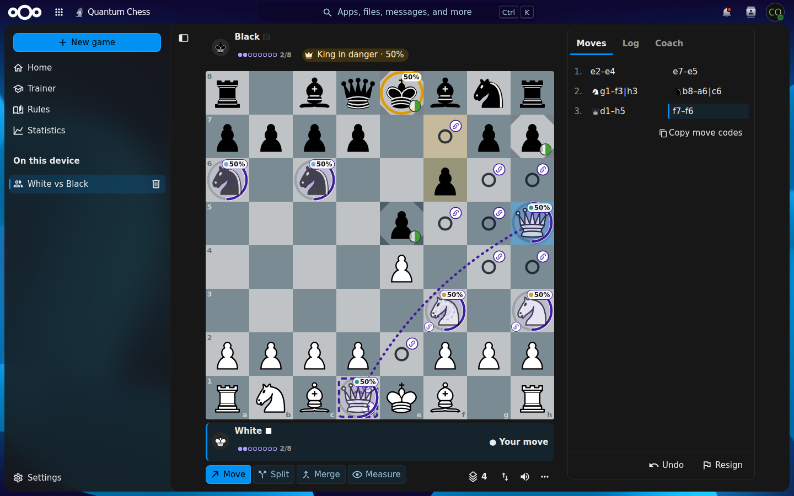
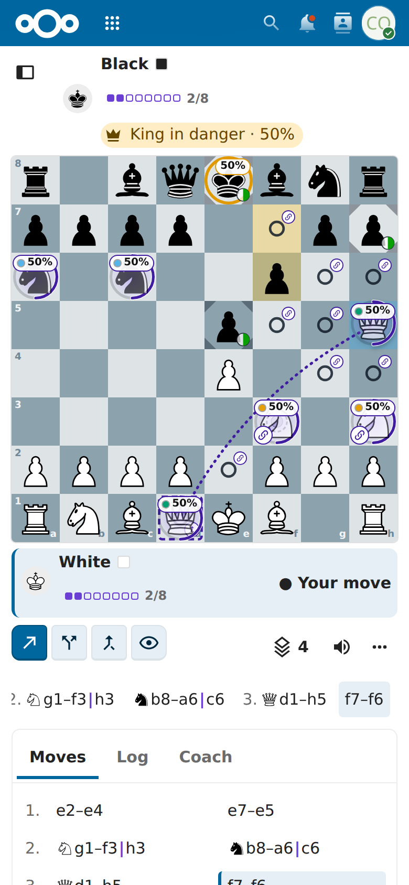

<!--
  - SPDX-FileCopyrightText: 2026 BeeFlow
  - SPDX-License-Identifier: AGPL-3.0-or-later
-->

# Quantum Chess for Nextcloud

[](https://github.com/bee-flow/quantum_chess/actions/workflows/ci.yml)
[](LICENSE)
[](https://apps.nextcloud.com/apps/quantumchess)

**Chess in which a piece can stand on two squares at once, until something asks where it really is.**
Quantum Chess lives inside your Nextcloud: challenge colleagues and family with the notifications, avatars and
dashboard you already use, play the computer or an AI opponent, or learn the game in ten minutes with the trainer.



- [Features](#features) · [Screenshots](#screenshots) · [The rules in one minute](#the-rules-in-one-minute)
- [Installation](#installation) · [Administration](#administration) · [AI opponents and the AI coach](#ai-opponents-and-the-ai-coach)
- [Multiplayer](#multiplayer) · [Privacy and security](#privacy-and-security) · [Planned](#planned)
- [Development](#development) · [Credits](#credits) · [License](#license)

## Features

**Play**

- 👥 **Online** correspondence games with anyone on your Nextcloud: invitations and open challenges, 1, 3 or 7 days
  per move, draw offers, rematches, chat with quick phrases, Elo ratings and an opt-in leaderboard
- 🤖 **Computer**: the built-in computer player with five levels, from *Wobbles* to *The Observer*, running in your
  browser
- ✨ **AI opponents** with a personality, powered by Nextcloud Assistant, your organisation's provider or your own
  API key (OpenAI-compatible services such as OpenAI, Mistral, OpenRouter, Groq, Gemini, Ollama or LocalAI, and
  Anthropic)
- 🪑 **Pass & play** on one device

**Learn**

- Eleven short interactive lessons: the essentials in about ten minutes
- Eleven machine-verified puzzles
- A coach with an evaluation bar, hints, threat warnings and move-quality badges, plus an AI coach you can ask about
  the position
- Post-game review with an evaluation graph and the key moments of the game

**Native and fair**

- Built with Nextcloud's own components: light, dark and high-contrast themes, keyboard and screen-reader support,
  phone, tablet and desktop layouts
- Notifications with actions in the web, mobile and desktop clients, and a dashboard widget
- Every roll shows its exact odds before you move and explains itself afterwards
- Online rolls are drawn by the server at the moment a move is applied and chained together, so later changes to
  moves you have seen show up; the coach stays off in your running online games
- API keys are stored encrypted on your server and never reach the browser. Nothing is sent anywhere except to the
  AI provider you choose.
- In **English, Dutch, German and French** (the app, notifications, settings pages, lessons and rules)

## Screenshots

| | |
|---|---|
|  |  |
| **Ghosts and links**: a split knight, its odds and a link | **The roll**: odds first, then the result and an explanation |
|  |  |
| **Lobby and dashboard**: your games, invitations and open challenges | **Trainer**: eleven lessons and eleven puzzles |
|  |  |
| **AI opponents** with a personality | **Dark theme** and high contrast follow Nextcloud |
|  | |
| **Phone layout** | |

The screenshots are produced from a seeded demo on a real Nextcloud with `npm run screenshots`
(see [`screenshots/README.md`](screenshots/README.md)).

## The rules in one minute

1. **It's chess.** Same board, same pieces, same moves, including castling, en passant and promotion.
2. **Capture the king to win.** There is no check. The game warns you when your king is in danger, and if every
   move leaves a king to be captured for certain, that side has lost: its king cannot escape.
3. **Split** a knight, bishop, rook or queen onto two empty squares: it becomes a **ghost**, 50 % on each.
4. **Merge** the parts back together. Merging onto an enemy piece captures it, for certain when every part surely
   arrives.
5. **Land = roll, pass = link.** Landing where a piece might be is settled by a fair roll: *Captured*, *Moved* or
   *Missed*, with the odds shown before you move. Sliding past such a square rolls nothing but links the pieces.
6. **Kings and pawns are always solid.** **Measure** spends your turn to find out where one of your ghosts really is.
7. Each side has a **budget of 8** possible arrangements, so at most three 50/50 ghosts at a time.

The complete rules, with examples and a glossary: [`docs/rules.md`](docs/rules.md). The in-app *Rules* page shows the
same rules with live mini-boards, and the trainer teaches them hands-on.

## Installation

**Requirements**: Nextcloud 32 to 35 on 64-bit PHP (8.1 or later, as far as your Nextcloud version supports it) with
any database Nextcloud supports. The app has no other server dependencies and runs without `vendor/`.

### From the App Store (recommended)

1. As an administrator open **Apps → Games**, find **Quantum Chess** and click **Download and enable**.
2. Or on the command line: `occ app:install quantumchess`.

Updates arrive through the normal app update mechanism.

### Manually from a release

1. Download `quantumchess-vX.Y.Z.tar.gz` from the [releases page](https://github.com/bee-flow/quantum_chess/releases).
   The archive is signed with the App Store certificate, so Nextcloud's code integrity check accepts it.
2. Extract it into your apps directory, for example `custom_apps/` (the folder must be called `quantumchess`), and give
   the web server user ownership:
   ```sh
   tar -xzf quantumchess-vX.Y.Z.tar.gz -C /var/www/nextcloud/custom_apps
   chown -R www-data:www-data /var/www/nextcloud/custom_apps/quantumchess
   ```
3. Enable it: `sudo -u www-data php occ app:enable quantumchess`.

To install from source instead, see [Development](#development).

## Administration

Everything is configured in **Administration settings → Quantum Chess**; users find their own options in
**Personal settings → Quantum Chess** and in the in-app settings (at the bottom of the app navigation).

### Background jobs

Correspondence games need a clock. The `GameMaintenanceJob` runs every 15 minutes: it expires unanswered invitations
and open challenges, ends games whose move deadline passed, ends games that never got their first moves, deletes old
chat and cleans up AI bookkeeping.

- Use **Cron** as the background job mode (Administration settings → Basic settings), with the system cron calling
  `cron.php` every 5 minutes, as the Nextcloud documentation recommends.
- With *AJAX* or *Webcron* the app still behaves correctly: deadlines are also checked whenever a game is opened or
  polled. The *Diagnostics* section of the admin page shows the background job mode.

### Multiplayer settings

| Setting | Default | |
|---|---|---|
| Online play on or off, and for which groups | on, everyone | Users outside the groups can still play locally |
| Open challenges | on | Challenges anyone allowed to play online can join |
| Rated games | on | Elo ratings and the leaderboard |
| Invitation / open challenge expiry | 14 / 7 days | |
| Active games per user | 30 | |
| Chat, and how long chat is kept | on, 90 days after the game | |
| Delete finished games after | never | Optional purge, 30 days or more |
| Leaderboard | opt-in | Off, opt-in or opt-out; minimum games, activity window and groups are configurable |

### Performance

- An open online game polls the server; an unchanged poll costs one indexed query.
- A **distributed cache** (`memcache.distributed`, for example Redis or APCu locally) is recommended: with it, AI
  requests are limited to one at a time per user, provider model lists are cached for an hour and unsupported
  parameters are remembered. Without a cache these optimisations are silently off.
- The computer player runs in the browser (in a web worker), and so do the rules of local games; the server only
  validates and applies online moves.

## AI opponents and the AI coach

The AI opponent and the AI coach need a text-generation service. There are three sources; users choose among those
the administrator made available, and the built-in computer player takes over whenever an AI does not answer in
time.

### 1. Nextcloud AI (Assistant / TaskProcessing)

Uses the AI provider configured for your whole Nextcloud, so no key is needed in Quantum Chess.

1. Install a text-generation provider, for example **OpenAI and LocalAI integration** (`integration_openai`, for
   OpenAI, LocalAI, Ollama and compatible services) or **Local large language model** (`llm2`, runs on your own
   hardware through AppAPI). The **Nextcloud Assistant** app is optional.
2. Quantum Chess prefers the *Chat* task type (`core:text2text:chat`) and falls back to *Free text to text prompt*
   (`core:text2text`). The admin page shows which provider answers and how long tasks took.
3. **Run a TaskProcessing worker.** Nextcloud processes AI tasks in background jobs; with plain cron an AI move can
   take up to five minutes. Dedicated workers pick tasks up immediately:
   ```sh
   sudo -u www-data php occ background-job:worker -t 60 'OC\TaskProcessing\SynchronousBackgroundJob'
   ```
   Run it permanently (for example as a systemd service, several instances for more parallelism); see *Improve AI
   task pickup speed* in the Nextcloud administration manual. The admin page advises this when the median task time
   exceeds 20 seconds.

The source can be switched off in the admin settings (`nc_ai_enabled`).

### 2. Organisation provider (a shared key)

The administrator configures one provider for everybody, or for chosen groups: choose a preset, the model and the API
key, then use *Test connection* and *Load models*. Options: the groups that may use it, a daily request cap (default
1000) and a list of models users may pick from. Saving the key asks for your password; the key is stored encrypted
and is never shown again (only its last four characters).

### 3. Personal keys

When personal API keys are allowed (`allow_personal_keys`, the default), each user can add their own provider in
Personal settings → Quantum Chess, with a key that only they use.

| Preset | Protocol | Base URL | Key |
|---|---|---|---|
| OpenAI | OpenAI chat | `https://api.openai.com/v1` | required |
| Anthropic | Messages API | `https://api.anthropic.com/v1` | required |
| Mistral · OpenRouter · Groq · Google Gemini | OpenAI chat | the provider's URL | required |
| Ollama · LocalAI · LM Studio | OpenAI chat | `http://localhost:11434/v1` · `:8080/v1` · `:1234/v1` | optional |
| Custom | OpenAI chat | any HTTPS URL, or a local one from the allow-list | optional |

### Local AI servers

Requests to local and private addresses (localhost, private networks, `*.local`) are blocked by default, so that
nobody can use Quantum Chess to probe your internal network.

- For the **organisation provider**, allow a local address (setting `shared_allow_local`) to use, say, an Ollama
  server in your LAN.
- For **personal providers**, add the exact base URLs users may choose to the local server allow-list
  (`local_allowlist`), for example `http://localhost:11434/v1`. A user's URL must match an entry exactly.
- Every other provider URL must use `https`; redirects are never followed and credentials in URLs are refused.

### Limits

AI requests per user and hour (default 60, across all sources, one request at a time), the maximum answer length
(800 tokens), an optional pseudonymous safety identifier for providers that ask for one (an HMAC, never the user
id), and an optional text you can append to the first-use notice (for example a link to your AI policy).

## Multiplayer

- **Correspondence play**: 1, 3 or 7 days per move (default 3), or no deadline for unrated games. When time runs out,
  the late player loses; it is a draw if the opponent has only a king left, and the game is aborted if the late player
  had not moved yet. There are no live clocks.
- **Finding opponents**: invite anyone you can find in Nextcloud's user search (Nextcloud's sharing restrictions to
  groups apply), or post an open challenge. Failed invitations never reveal whether a user exists.
- **Notifications** for invitations, your turn, draw offers, results and chat, with *Accept*, *Decline* and *Rematch*
  actions in the web interface and the mobile and desktop clients, in each recipient's language. Each kind can be
  switched off in the personal settings, and chat previews can be hidden.
- **Updates**: open games poll the server adaptively (every 2 seconds right after your move, slower while you wait,
  once a minute in background tabs), with back-off and a banner when the connection is lost.
- **Ratings**: Elo starting at 1200; the first 10 rated games use K = 40 (the rating is shown as provisional), then
  K = 20. Colours in rated games are assigned at random.
- **Fair play**: in your own online games that are still running, the coach, hints, analysis and the AI coach are
  not available. The king-danger ring and the safety net stay, because they are rule information.
- **Integrity**: the server draws every online roll with a cryptographic random number generator when it applies the
  move, stores it with its odds and chains each move to the previous one. Clients check the chain and warn if the
  history of a game they have seen was altered later.

## Privacy and security

Quantum Chess makes **no requests to external services** except the AI provider an administrator or user
configured: no CDNs, no external fonts, no telemetry, no per-user tracking.

**Sent to an AI provider**: the position as text, the move history as move codes, the legal moves, the computer
player's candidate moves, the chosen persona, the question the user typed and the language of the interface.
**Never sent**: user ids, display names, e-mail addresses, the opponent's identity, chat messages or the address of
your Nextcloud. Online games appear as "White" and "Black". Before the first request to a source, users see a notice
naming the provider, with your optional addition.

### Data inventory

For your records of processing activities:

| Data | Where | Visible to | Retention |
|---|---|---|---|
| Games, moves, rolls, chain, results | `qchess_games`, `qchess_moves` | both players; admins (database) | while one player exists; optional purge after N days |
| Chat | `qchess_chat` | both players | 90 days after the game (configurable) |
| Rating and record | `qchess_ratings` | self, opponents, the leaderboard only if listed | account lifetime |
| Preferences, trainer progress, local statistics | user settings | self | account lifetime |
| Local games and roll memo | browser `localStorage` | self (this browser) | until deleted |
| Personal API key | user settings, encrypted, marked sensitive | no page or API ever returns it | until removed |
| AI prompts and answers | not stored; the temporary TaskProcessing task is deleted after reading | – | – |
| AI usage counters | app settings, per day and source, aggregated, no per-user logs | admins | 30 days |

**Deleting an account** ends that user's running games (the opponent is notified), removes their pending invitations
and open challenges, and keeps finished games for the other player with the name replaced by "Deleted user". A
self-service *Export my games* and *Delete my Quantum Chess data* are [planned](#planned).

### Security notes

- **API keys** are encrypted with Nextcloud's `ICrypto`, stored as sensitive values (hidden from `occ config:list`
  and system reports), never logged and never sent to a browser. Be aware that encryption at rest protects against a
  leaked database dump, not against the server's administrators: anyone with access to both the database and
  `config.php` can decrypt the keys. Users who do not want to trust their administrators with a key should use the
  organisation provider or Nextcloud AI instead.
- **Outbound requests** go through Nextcloud's HTTP client with the local-address protection described above,
  timeouts of at most 90 seconds and no redirects. Upstream error messages never reach the browser.
- **Rate limits** protect game creation, moves, chat, polling, AI requests and connection tests.
- **Authorisation**: every game endpoint checks that you take part in the game and answers *not found* otherwise,
  so game ids cannot be probed. Moves are validated only by the server's rules engine; client states are never
  trusted.
- Saving an admin secret requires password confirmation.

Please report vulnerabilities privately, as described in the [security policy](.github/SECURITY.md).

## Planned

These features are designed but not built yet:

- **Online**: move reminders and quiet hours, a personal invite policy and block list, *Export my games* and
  *Delete my Quantum Chess data*, history filters, an admin badge, a limit on rated games between the same two
  players, server-side refusal of AI help for rated games in progress, faster polling through the distributed cache
  and shared updates between tabs.
- **Board**: *Show the other result*, viewing one possibility, typed moves, the Letters piece set, haptics, tabletop
  mode for pass & play, heat maps and more board themes.
- **Trainer and coach**: the Lab, achievements and the trophy cabinet, hint tiers 3 and 4, accuracy, a luck ledger and
  *Verify* in the review.

## Development

You need Node.js 22 with npm 10, PHP 8.1 or later with Composer, and a development Nextcloud (32–35). Clone the
repository into the server's `apps/` directory as `quantumchess`, run `npm ci`, `composer install` and `make build`,
and enable the app with `occ app:enable quantumchess`. `make test` and `make lint` run the unit tests and every
linter. [`CONTRIBUTING.md`](CONTRIBUTING.md) describes the whole workflow: the tests, end-to-end tests, translations,
the rules-engine fixtures and the conventions.

**Documentation for contributors**

- [`docs/rules.md`](docs/rules.md): the rules for players
- [`docs/engine-rules.md`](docs/engine-rules.md): the normative rules for the JavaScript and PHP rules engines
- [`docs/development/architecture.md`](docs/development/architecture.md): how the app is built, and its conventions
- [`docs/development/api.md`](docs/development/api.md): the HTTP API and the database schema
- [`RELEASING.md`](RELEASING.md): how a release is signed and published

## Credits

- Chess pieces: the **cburnett** set by Colin M.L. Burnett, licensed GPL-2.0-or-later (taken from lichess.org's
  chessground); see [`img/pieces/cburnett/LICENSE.md`](img/pieces/cburnett/LICENSE.md).
- Built with [Nextcloud Vue components](https://github.com/nextcloud-libraries/nextcloud-vue) and
  [Material Design Icons](https://pictogrammers.com/library/mdi/) (Apache-2.0).
- Made by [BeeFlow](https://beeflow.nl).

## License

Quantum Chess is free software: you can redistribute it and/or modify it under the terms of the
[GNU Affero General Public License](LICENSE) as published by the Free Software Foundation, either version 3 of the
License, or (at your option) any later version. The cburnett piece images are licensed under the GNU General Public
License version 2 or later and are distributed as part of this work under the GPL-3.0-or-later.
